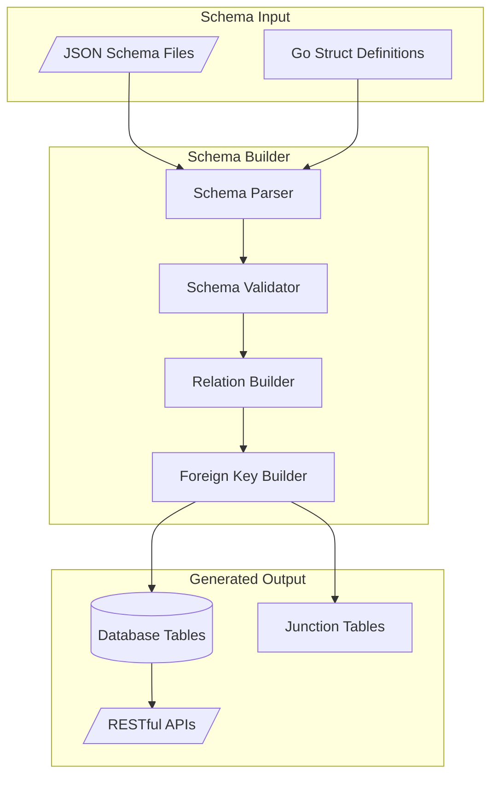
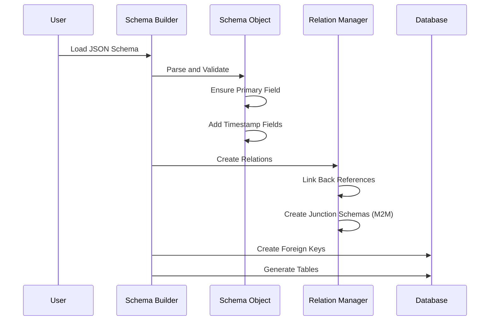
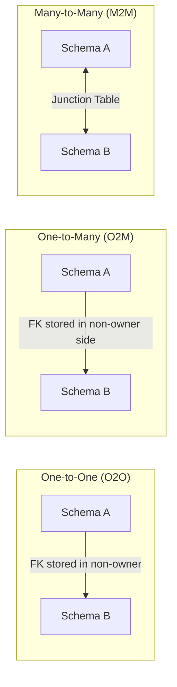
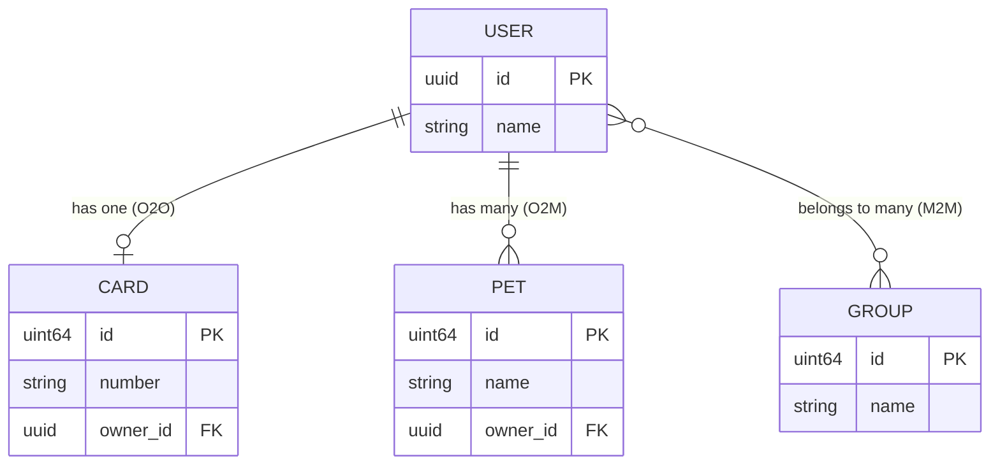
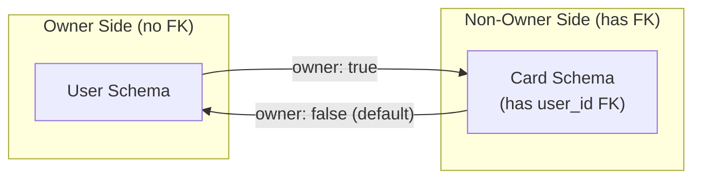
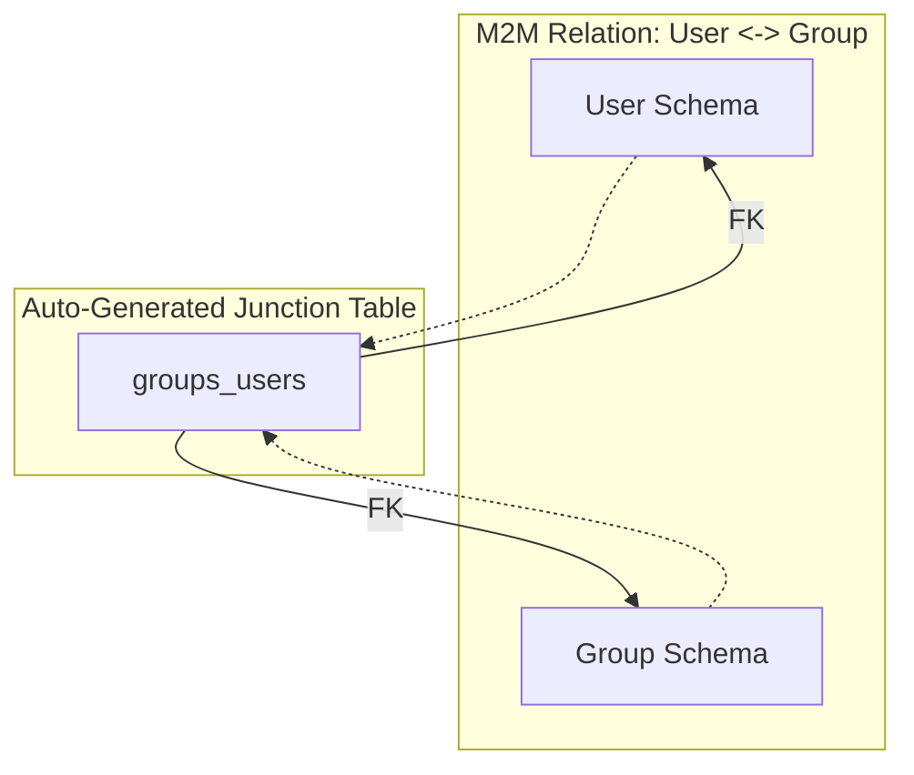
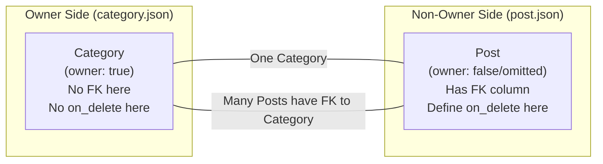

# FastSchema Schema System Documentation

This document provides a comprehensive guide to the FastSchema schema system, enabling you to define database schemas using JSON files. FastSchema automatically generates the database structure and RESTful APIs based on your schema definitions.

## Table of Contents

1. [Quick Reference](#quick-reference)
2. [Critical Warnings](#critical-warnings)
3. [Architecture Overview](#architecture-overview)
4. [System Schemas](#system-schemas)
5. [Schema Structure](#schema-structure)
6. [Field Types](#field-types)
7. [Field Configuration](#field-configuration)
8. [Primary Keys](#primary-keys)
9. [Database Configuration](#database-configuration)
10. [Relations](#relations)
11. [Timestamps](#timestamps)
12. [Common Patterns](#common-patterns)
13. [Validation Rules](#validation-rules)
14. [Complete Examples](#complete-examples)
15. [Troubleshooting](#troubleshooting)

---

## Quick Reference

This section provides condensed rules for generating valid FastSchema schemas.

### Schema File Checklist

```
✓ name         - lowercase, snake_case (e.g., "post")
✓ namespace    - unique, snake_case (plural form conventional, e.g., "posts")
✓ label_field  - must reference an existing field name
✓ fields       - array with at least one field
```

### Field Type Quick Guide

| Use Case | Type | Example |
|----------|------|---------|
| Short text (≤255 chars) | `string` | names, titles, emails |
| Long text | `text` | descriptions, content |
| Yes/No | `bool` | is_active, is_published |
| Whole numbers | `int64` or `uint64` | counts, quantities |
| Decimal numbers | `float64` | prices, ratings |
| Date/time | `time` | created_at, published_at |
| Fixed options | `enum` | status, category_type |
| Arbitrary data | `json` | metadata, settings |
| Unique identifier | `uuid` | external_id |
| Link to another schema | `relation` | author, category |
| Attachments | `file` | avatar, documents |

### Relation Decision Tree

```
Q: How many records on each side?

One A → One B?          → Use O2O
One A → Many B?         → Use O2M
Many A → Many B?        → Use M2M

Q: Which side should have the FK column (non-owner)?

The side that "belongs to" the other → Non-owner (omit owner or set false)
The side that "has" the other       → Owner (set owner: true)
```

### Relation Ownership Rules

| Scenario | Owner Side | Non-Owner Side (has FK) |
|----------|-----------|------------------------|
| User has one Card | User (`owner: true`) | Card (omit or `owner: false`) |
| User has many Pets | User (`owner: true`) | Pet (omit or `owner: false`) |
| Post belongs to Category | Category (`owner: true`) | Post (omit or `owner: false`) |
| Users ↔ Groups (M2M) | Either side can be owner | Junction table created |

**Rule:** The FK column is always created on the non-owner side. By default, the FK column is auto-generated as `{field_name}_id`. You can customize this with `source_column` - see [Custom Foreign Key Columns](#custom-foreign-key-columns).

### Relation Field Template

**Owner side (no FK column):**
```json
{
  "name": "{relation_field_name}",
  "label": "{Human Label}",
  "type": "relation",
  "relation": {
    "type": "{o2o|o2m|m2m}",
    "schema": "{target_schema_name}",
    "field": "{backref_field_name_in_target}",
    "owner": true
  }
}
```

**Non-owner side (has FK column):**
```json
{
  "name": "{relation_field_name}",
  "label": "{Human Label}",
  "type": "relation",
  "relation": {
    "type": "{o2o|o2m}",
    "schema": "{target_schema_name}",
    "field": "{backref_field_name_in_target}"
  }
}
```

> **Note:** For non-owner side, `owner` defaults to `false` and can be omitted.

### Required vs Optional

- **All fields are required by default**
- Add `"optional": true` for nullable fields
- Relation fields follow the same rule

### Naming Conventions

| Element | Convention | Example |
|---------|-----------|---------|
| Schema name | singular, snake_case | `post` |
| Namespace | unique, snake_case (plural form conventional) | `posts` |
| Field name | snake_case | `created_at`, `user_id` |
| Relation backref | matches the relation field on other side | See examples |

---

## Critical Warnings

Before authoring schemas, internalize these four behaviors. Each is a one-way
decision or a server-side enforcement rule that authors commonly miss.

### 1. `namespace` is Permanent — It's the SQL Table Name

**Rule:** Treat `namespace` as immutable after a schema is created. Renaming it is a breaking change.

**Why it matters:** `namespace` becomes the SQL table name. REST URLs use schema `name` (not `namespace`) so URL paths remain stable — but every SQL artifact (migration files, backups, foreign keys referenced from other schemas, any direct DB query) references the namespace. Changing it requires a coordinated migration across all of these.

**Migration cost:** HIGH. Rename migration + update all FK references + replay backups + coordinate with any consumer that queries the DB directly.

**✅ Correct — set once at creation:**
```json
{
  "name": "post",
  "namespace": "posts",
  "label_field": "title",
  "fields": [ ... ]
}
```

**❌ Avoid:** Renaming `namespace` in production without a coordinated migration plan.

Cross-reference: [Schema Structure](#schema-structure).

### 2. `disable_timestamp: true` is a One-Way Decision

**Rule:** If `disable_timestamp: true` is set at schema creation, timestamps cannot be re-enabled later without a full schema migration.

**Why it matters:** When `disable_timestamp: true`, FastSchema skips generating `created_at`, `updated_at`, and `deleted_at` columns. Soft-delete behavior (auto-filter `WHERE deleted_at IS NULL`) is also disabled. Re-enabling later means adding three columns + (usually) backfilling a NOT NULL `created_at` — a destructive-adjacent operation.

**Migration cost:** MEDIUM. Adding timestamp columns later requires migration + backfill.

**✅ Default (timestamps enabled — the common case):**
```json
{
  "name": "post",
  "namespace": "posts",
  "label_field": "title",
  "fields": [ ... ]
}
```

**⚠ Set `disable_timestamp: true` only if the schema never needs auditability or soft-delete.**

Cross-reference: [Timestamps](#timestamps).

### 3. `sortable: false` IS Enforced Server-Side

**Rule:** REST requests attempting to sort by a field where `sortable: false` return an error: `column "X" is not sortable`.

**Why it matters:** Authors often assume `sortable` is a UI hint only. It is not. The ent DB adapter validates the sort column against the field's `Sortable` flag before executing the query (see `pkg/entdbadapter/query.go` in the `Sortable` check). If you set `sortable: false` and a client requests `?sort=field_name`, the request fails at the DB layer.

**Implication:** Set `sortable: true` on every field you expect clients to sort by. Primary keys are auto-sortable. System timestamp fields (`created_at`, `updated_at`, `deleted_at`) are auto-sortable.

**✅ Explicit for user-queryable fields:**
```json
{
  "name": "title",
  "type": "string",
  "sortable": true,
  "filterable": true
}
```

**⚠ Not an index:** `sortable: true` does NOT create a DB index. For query performance on frequently sorted/filtered fields, use `schema.db.indexes`.

Cross-reference: [Field Configuration](#field-configuration), [Database Configuration](#database-configuration).

### 4. `filterable: false` is NOT Enforced Server-Side (Asymmetric with `sortable`)

**Rule:** REST requests with `?filter={field:...}` succeed even when `filterable: false`. This is intentional and asymmetric with `sortable`.

**Why it matters:** `filterable` is an admin-UI hint — it controls whether the admin dashboard shows a filter button for the field. It does NOT gate the HTTP API. Any field can be filtered via REST regardless of the flag.

**Implication:** Do not rely on `filterable: false` to prevent clients from querying a field. For access control, use role-based permissions, not this flag.

**✅ Use the flag for UI presentation only:**
```json
{
  "name": "internal_note",
  "type": "text",
  "filterable": false
}
```

**Asymmetry recap:**

| Flag                | Server-side enforcement | UI behavior        |
|---------------------|-------------------------|--------------------|
| `sortable: false`   | ✅ Errors on `?sort=X`   | Hides sort option  |
| `filterable: false` | ❌ No enforcement        | Hides filter option|

Cross-reference: [Field Configuration](#field-configuration).

---

## Architecture Overview

FastSchema uses a declarative approach where schemas are defined in JSON files. The system processes these definitions to create database tables, manage relationships, and expose RESTful APIs.

### System Architecture



### Schema Processing Flow



---

## System Schemas

FastSchema includes built-in **system schemas** that provide core functionality. These schemas are defined in Go code and automatically included in every FastSchema project.

### Available System Schemas

| Schema | Namespace | Description | Extensible |
|--------|-----------|-------------|------------|
| `user` | `users` | User accounts with authentication fields | Yes |
| `role` | `roles` | User roles for authorization | Yes |
| `permission` | `permissions` | Role-based permissions | No |
| `file` | `files` | File storage metadata | Yes |
| `session` | `sessions` | User sessions and refresh tokens | No |
| `migration` | `migrations` | Database migration tracking | No |

### System Schema Default Fields

#### User Schema (`user`)

The `user` schema includes these built-in fields:

| Field | Type | Description |
|-------|------|-------------|
| `id` | `uuid` | Primary key (auto-generated) |
| `username` | `string` | Optional, unique, sortable |
| `email` | `string` | Optional, unique, sortable |
| `first_name` | `string` | Optional, sortable |
| `last_name` | `string` | Optional, sortable |
| `bio` | `string` | Optional user biography |
| `password` | `string` | Hashed password (auto-hashed via setter) |
| `active` | `bool` | Account active status |
| `provider` | `string` | OAuth provider (github, google, etc.) |
| `provider_id` | `string` | OAuth provider user ID |
| `provider_username` | `string` | OAuth provider username |
| `provider_profile_image` | `string` | OAuth profile image URL |
| `avatar_id` | `uuid` | FK to file schema |
| `avatar` | `relation` | O2M relation to file |
| `roles` | `relation` | M2M relation to role |
| `files` | `relation` | O2M relation to file (owned files) |
| `created_at` | `time` | Creation timestamp |
| `updated_at` | `time` | Last update timestamp |
| `deleted_at` | `time` | Soft delete timestamp |

**Valid `label_field` values:** `username`, `email`, `first_name`, `last_name`

#### Role Schema (`role`)

| Field | Type | Description |
|-------|------|-------------|
| `id` | `uuid` | Primary key |
| `name` | `string` | Role name |
| `description` | `string` | Optional role description |
| `root` | `bool` | If true, bypasses all permission checks |
| `system` | `bool` | System-defined role (Admin, User, Guest) |
| `users` | `relation` | M2M relation to user |
| `permissions` | `relation` | O2M relation to permission |
| `rule` | `string` | Optional expression rule |

**Valid `label_field` values:** `name`, `description`

#### File Schema (`file`)

| Field | Type | Description |
|-------|------|-------------|
| `id` | `uuid` | Primary key |
| `disk` | `string` | Storage disk name |
| `name` | `string` | File name |
| `path` | `string` | File path on disk |
| `type` | `string` | MIME type |
| `size` | `uint64` | File size in bytes |
| `owner_id` | `uuid` | FK to user schema |
| `owner` | `relation` | O2M relation to user |

**Valid `label_field` values:** `name`, `path`, `type`

### Extending System Schemas

You can extend system schemas by creating JSON files with the same name in your schemas directory. FastSchema will merge your custom fields with the system schema.

**Important rules:**
- The JSON file name must match the system schema name (e.g., `user.json`, `role.json`, `file.json`)
- You can add **any type of new fields** (string, text, int, relation, etc.) but cannot modify existing system fields
- You must include back-reference fields for any relations from other schemas that point to this system schema
- **CRITICAL: The `label_field` MUST reference a field that exists in the system schema** (not a new field you're adding)

#### Common Mistakes When Extending System Schemas

**WRONG - Causes "label field not found" error:**
```json
// user.json - WRONG! "title" doesn't exist in user schema
{
  "name": "user",
  "namespace": "users",
  "label_field": "title",  // ERROR: "title" is not a user field!
  "fields": [...]
}
```

**CORRECT - Uses existing system field:**
```json
// user.json - CORRECT! "username" exists in user system schema
{
  "name": "user",
  "namespace": "users",
  "label_field": "username",  // OK: "username" exists in user schema
  "fields": [...]
}
```

#### Extending User Schema

To add custom fields to the user schema and enable other schemas to reference it:

```json
// user.json
{
  "name": "user",
  "namespace": "users",
  "label_field": "username",
  "fields": [
    {
      "name": "phone",
      "label": "Phone Number",
      "type": "string",
      "optional": true
    },
    {
      "name": "department",
      "label": "Department",
      "type": "string",
      "optional": true
    },
    {
      "name": "posts",
      "label": "Posts",
      "type": "relation",
      "relation": {
        "type": "o2m",
        "schema": "post",
        "field": "author",
        "owner": true
      }
    },
    {
      "name": "liked_posts",
      "label": "Liked Posts",
      "type": "relation",
      "optional": true,
      "relation": {
        "type": "m2m",
        "schema": "post",
        "field": "likes"
      }
    }
  ]
}
```

#### Extending File Schema for File Fields

When using `file` type fields in your schemas, you must create a `file.json` with back-reference fields:

```json
// file.json
{
  "name": "file",
  "namespace": "files",
  "label_field": "name",
  "fields": [
    {
      "name": "user_avatar",
      "label": "User Avatar",
      "type": "relation",
      "optional": true,
      "relation": {
        "type": "o2m",
        "schema": "user",
        "field": "avatar",
        "owner": true
      }
    },
    {
      "name": "post_featured_image",
      "label": "Post Featured Image",
      "type": "relation",
      "optional": true,
      "relation": {
        "type": "o2m",
        "schema": "post",
        "field": "featured_image",
        "owner": true
      }
    },
    {
      "name": "product_images",
      "label": "Product Images",
      "type": "relation",
      "optional": true,
      "relation": {
        "type": "m2m",
        "schema": "product",
        "field": "images"
      }
    }
  ]
}
```

### Referencing System Schemas

You can create relations to system schemas just like any other schema:

```json
// post.json
{
  "name": "post",
  "namespace": "posts",
  "label_field": "title",
  "fields": [
    { "name": "title", "type": "string", "label": "Title" },
    { "name": "content", "type": "text", "label": "Content" },
    {
      "name": "author",
      "label": "Author",
      "type": "relation",
      "relation": {
        "type": "o2m",
        "schema": "user",
        "field": "posts"
      }
    }
  ]
}
```

**Note:** When referencing `user`, `role`, or `file` schemas, you must also extend them with the back-reference field. See the examples above.

### Relation Resolution



---

## Schema Structure

A FastSchema schema JSON file contains the following top-level properties:

| Property | Type | Required | Description |
|----------|------|----------|-------------|
| `name` | string | Yes | The unique identifier for the schema. Used as the database table name. |
| `namespace` | string | Yes | The URL namespace for RESTful API endpoints. Must be unique across all schemas. Plural form is conventional but not enforced; any snake_case string works (e.g., test schemas use `pk_users`, `book_fk`). |
| `label_field` | string | Yes | The field name used as the display label for records. |
| `primary_field` | string | No | Specifies a custom primary key field name. If not specified, uses `id`. The referenced field must exist and be of an allowed primary key type. |
| `disable_timestamp` | boolean | No | When `true`, disables automatic `created_at`, `updated_at`, and `deleted_at` fields. |
| `fields` | array | Yes | An array of field definitions. |
| `db` | object | No | Database-specific configurations like indexes. |
| `is_system_schema` | boolean | No | Marks the schema as FastSchema-managed. **Do NOT set in user application schemas** — reserved for FastSchema internals and plugin authors. |
| `is_junction_schema` | boolean | No | Marks the schema as an auto-generated M2M junction table. **Do NOT set manually** — FastSchema creates junction schemas automatically. |

> **Note on `data/schemas/*.json`:** The files shipped in FastSchema's `data/schemas/` directory (`user.json`, `role.json`, `file.json`, `product.json`, etc.) are FastSchema's **own** internal and test schemas — they include `"is_system_schema": true` because they are system-managed. **Do not copy this flag when authoring your application's schemas.** User-authored schemas should omit both `is_system_schema` and `is_junction_schema` entirely.

> ⚠ **Namespace is permanent.** It becomes the SQL table name. Renaming it after a schema is in production is a breaking change — see [Critical Warnings #1](#1-namespace-is-permanent--its-the-sql-table-name).

### Basic Schema Example

```json
{
  "name": "product",
  "namespace": "products",
  "label_field": "name",
  "fields": [
    {
      "name": "name",
      "label": "Product Name",
      "type": "string",
      "unique": true
    },
    {
      "name": "price",
      "label": "Price",
      "type": "float64"
    },
    {
      "name": "description",
      "label": "Description",
      "type": "text",
      "optional": true
    }
  ]
}
```

---

## Field Types

FastSchema supports the following field types:

### Primitive Types

| Type | Description | JSON Example |
|------|-------------|--------------|
| `bool` | Boolean value (true/false) | `"type": "bool"` |
| `string` | Short text (max 255 characters by default) | `"type": "string"` |
| `text` | Long text (unlimited length) | `"type": "text"` |
| `uuid` | UUID string | `"type": "uuid"` |
| `bytes` | Binary data | `"type": "bytes"` |
| `json` | JSON data | `"type": "json"` |
| `time` | Date and time | `"type": "time"` |

### Integer Types

| Type | Description | Range |
|------|-------------|-------|
| `int` | Platform-dependent integer | Varies |
| `int8` | 8-bit signed integer | -128 to 127 |
| `int16` | 16-bit signed integer | -32,768 to 32,767 |
| `int32` | 32-bit signed integer | -2,147,483,648 to 2,147,483,647 |
| `int64` | 64-bit signed integer | -9,223,372,036,854,775,808 to 9,223,372,036,854,775,807 |
| `uint` | Platform-dependent unsigned integer | Varies |
| `uint8` | 8-bit unsigned integer | 0 to 255 |
| `uint16` | 16-bit unsigned integer | 0 to 65,535 |
| `uint32` | 32-bit unsigned integer | 0 to 4,294,967,295 |
| `uint64` | 64-bit unsigned integer | 0 to 18,446,744,073,709,551,615 |

### Floating-Point Types

| Type | Description |
|------|-------------|
| `float32` | 32-bit floating-point number |
| `float64` | 64-bit floating-point number (recommended) |

### Special Types

| Type | Description | Requirements |
|------|-------------|--------------|
| `enum` | Enumerated values | Requires `enums` array |
| `relation` | Relationship to another schema | Requires `relation` object |
| `file` | File attachment | Automatically creates relation to `file` schema |

### Type Aliases

FastSchema accepts common synonyms for field types and one relation type. Canonical names (left column) are preferred for new schemas; aliases exist for ergonomics and cross-tool compatibility.

#### Field Type Aliases

| Canonical | Accepted Aliases |
|-----------|------------------|
| `bool` | `boolean` |
| `int` | `integer` |
| `float64` | `number`, `float`, `double` |
| `time` | `datetime`, `timestamp`, `date` |
| `string` | `varchar` |
| `text` | `longtext` |
| `json` | `object`, `array` |

#### Relation Type Aliases

| Canonical | Accepted Aliases | Notes |
|-----------|------------------|-------|
| `o2m` | `m2o` | `m2o` expresses the inverse perspective (many-to-one); parsed identically to `o2m` |

**Both forms are valid:**

```json
{ "name": "is_active", "type": "boolean" }     // alias
{ "name": "is_active", "type": "bool" }        // canonical (preferred)
```

**Recommendation:** Use canonical names within a project for consistency.

### Enum Field Example

```json
{
  "name": "status",
  "label": "Status",
  "type": "enum",
  "enums": [
    { "value": "draft", "label": "Draft" },
    { "value": "published", "label": "Published" },
    { "value": "archived", "label": "Archived" }
  ]
}
```

### File Field Example

File fields create a relation to the built-in `file` schema. Use `multiple: true` for multiple file attachments.

**Single file:**
```json
{
  "name": "avatar",
  "label": "Avatar",
  "type": "file",
  "optional": true
}
```

**Multiple files:**
```json
{
  "name": "attachments",
  "label": "Attachments",
  "type": "file",
  "multiple": true,
  "optional": true
}
```

**How file fields work:**
- File fields do **NOT** require a `relation` object - it is automatically generated internally
- A `file` field with `multiple: false` (default) creates an **O2M** relation to the `file` schema
- A `file` field with `multiple: true` creates an **M2M** relation to the `file` schema
- FastSchema expects the back-reference field in `file.json` to be named as `{schema_name}_{field_name}`
  - Example: A `post` schema with a `featured_image` file field expects a back-reference field named `post_featured_image` in file.json

**Important:** To use file fields, you must create a `file.json` schema file in your schemas directory that extends the system `file` schema with back-reference fields. The back-reference field name **must** follow the naming convention `{schema_name}_{field_name}`:

```json
// file.json
{
  "name": "file",
  "namespace": "files",
  "label_field": "name",
  "fields": [
    {
      "name": "user_avatar",
      "label": "User Avatar",
      "type": "relation",
      "optional": true,
      "relation": {
        "type": "o2m",
        "schema": "user",
        "field": "avatar",
        "owner": true
      }
    },
    {
      "name": "post_attachments",
      "label": "Post Attachments",
      "type": "relation",
      "optional": true,
      "relation": {
        "type": "m2m",
        "schema": "post",
        "field": "attachments"
      }
    }
  ]
}
```

---

## Field Configuration

Each field can have the following properties:

| Property | Type | Default | Description |
|----------|------|---------|-------------|
| `name` | string | Required | The field identifier (column name). |
| `label` | string | Same as `name` | Human-readable display name. If omitted, defaults to the field name. |
| `type` | string | Required | The field data type. |
| `size` | integer | Varies | Maximum size for string/bytes fields. |
| `multiple` | boolean | false | Allows multiple values (for file fields). |
| `unique` | boolean | false | Enforces unique constraint. |
| `optional` | boolean | false | Allows null values. |
| `default` | any | None | Default value when not provided. See [Default Values](#default-values) for special values. |
| `immutable` | boolean | false | Cannot be changed after creation. Automatically set `true` for: primary key fields, foreign key fields, and timestamp fields (`created_at`, `updated_at`, `deleted_at`). |
| `sortable` | boolean | false | Can be used for sorting in queries. |
| `filterable` | boolean | false | Can be used for filtering in queries. |
| `setter` | string | None | Expression to transform values before saving. |
| `getter` | string | None | Expression to transform values when reading. |
| `db` | object | None | Database-specific field configuration. |
| `relation` | object | None | Relation configuration (for relation type). |
| `enums` | array | None | Enum values (for enum type). |

> ⚠ **Sortable vs Filterable asymmetry.** `sortable: false` **IS** enforced server-side — the API rejects `?sort=X` with `column "X" is not sortable`. `filterable: false` is **NOT** enforced server-side — the API still accepts `?filter={X: ...}`. See [Critical Warnings #3](#3-sortable-false-is-enforced-server-side) and [Critical Warnings #4](#4-filterable-false-is-not-enforced-server-side-asymmetric-with-sortable).

### Field Examples

```json
{
  "fields": [
    {
      "name": "email",
      "label": "Email Address",
      "type": "string",
      "size": 100,
      "unique": true,
      "filterable": true
    },
    {
      "name": "age",
      "label": "Age",
      "type": "uint8",
      "optional": true,
      "sortable": true,
      "filterable": true
    },
    {
      "name": "bio",
      "label": "Biography",
      "type": "text",
      "optional": true,
      "default": ""
    },
    {
      "name": "is_active",
      "label": "Active",
      "type": "bool",
      "default": true,
      "filterable": true
    }
  ]
}
```

### Default Values

Default values are applied when a field is not provided during record creation. The `default` property supports different value types depending on the field type.

#### Literal Default Values

| Field Type | Default Value Example | Description |
|------------|----------------------|-------------|
| `bool` | `true` or `false` | Boolean literal |
| `int*`, `uint*` | `0`, `100`, `-5` | Integer literal |
| `float*` | `0.0`, `3.14`, `-1.5` | Float literal |
| `string`, `text` | `""`, `"default text"` | String literal |
| `enum` | `"draft"` | Must be a valid enum value |
| `json` | `{}`, `[]`, `null` | Valid JSON value |

#### Special Default Values for Time Fields

| Value | Description |
|-------|-------------|
| `"NOW()"` | Sets to current timestamp when record is created |
| `"CURRENT_TIMESTAMP"` | Alias for `NOW()` |

**Example:**
```json
{
  "name": "published_at",
  "label": "Published At",
  "type": "time",
  "optional": true,
  "default": "NOW()"
}
```

#### Default Value Examples

```json
{
  "fields": [
    {
      "name": "status",
      "type": "enum",
      "default": "draft",
      "enums": [
        { "value": "draft", "label": "Draft" },
        { "value": "published", "label": "Published" }
      ]
    },
    {
      "name": "view_count",
      "type": "uint64",
      "default": 0
    },
    {
      "name": "is_featured",
      "type": "bool",
      "default": false
    },
    {
      "name": "metadata",
      "type": "json",
      "optional": true,
      "default": {}
    }
  ]
}
```

### Immutable Fields

The `immutable` boolean marks a field as un-editable after the record is created. PATCH/PUT requests that attempt to change an immutable field are rejected at the application layer.

| Property | JSON Key | Type | Default |
|----------|----------|------|---------|
| Immutable | `immutable` | bool | `false` |

**Auto-set to `true` by the framework for:**
- Primary key field (any PK, including custom ones selected via `primary_field`).
- Auto-generated FK columns for O2O / O2M non-owner relations (e.g. the `author_id` column on a post).
- Timestamp fields (`created_at`, `updated_at`, `deleted_at`) when `disable_timestamp` is not set.
- All fields in auto-generated junction schemas (M2M).

**When to set explicitly:** For user-defined fields that represent facts which must never change after creation, such as `external_id`, `order_number`, audit log entries, or idempotency tokens.

**✅ Correct — custom immutable field:**
```json
{
  "name": "order",
  "namespace": "orders",
  "label_field": "reference",
  "fields": [
    { "name": "reference", "type": "string", "unique": true, "immutable": true },
    { "name": "total", "type": "float64" },
    { "name": "status", "type": "enum", "enums": [
      { "value": "pending", "label": "Pending" },
      { "value": "paid",    "label": "Paid" }
    ]}
  ]
}
```

**⚠ Don't set `immutable` on fields the framework already marks immutable** (PK, FK, timestamps, junction fields) — the redundant flag has no effect and adds noise to the schema JSON.

### System Fields (`is_system_field`)

The `is_system_field` boolean marks a field as framework-generated. It is **managed by FastSchema** — users must not set it manually on custom fields.

| Property | JSON Key | Type | Default | User-settable? |
|----------|----------|------|---------|----------------|
| IsSystemField | `is_system_field` | bool | `false` | **No** |

**Set automatically to `true` for:**
- The primary key field when auto-generated (default `id` UUID).
- Timestamp fields (`created_at`, `updated_at`, `deleted_at`).
- FK columns auto-generated for O2O / O2M non-owner relations.
- Both FK columns inside auto-generated junction schemas (M2M).
- All fields of a schema marked `is_system_schema: true` (FastSchema's own internal schemas).

**Effects:**
- **Excluded from schema save.** When FastSchema persists a schema back to its JSON file, system fields are filtered out. The raw JSON you author only contains user-defined fields; auto-generated fields are regenerated on load.
- Typically read-only in the admin UI.
- Protected from user-triggered deletion via the schema update API.

**⚠ Do NOT set `is_system_field: true` on your own fields.** If you do, FastSchema will filter them out when saving the schema — they will silently disappear on next reload.

**✅ Correct — leave it off (default `false`):**
```json
{
  "name": "department",
  "type": "string",
  "optional": true
}
```

**❌ Incorrect — will be filtered out on save:**
```json
{
  "name": "department",
  "type": "string",
  "is_system_field": true
}
```

---

## Primary Keys

FastSchema automatically creates an `id` field as the primary key if not specified. You can customize this behavior.

### Allowed Primary Key Types

Only the following field types can be used as primary keys:

| Type | Description | Value Generation |
|------|-------------|------------------|
| `uuid` | UUID string (default) | Automatically generated (UUID v7) |
| `uint64` | 64-bit unsigned integer | Auto-increment |
| `uint32` | 32-bit unsigned integer | Auto-increment |
| `uint` | Unsigned integer | Auto-increment |
| `int64` | 64-bit signed integer | Auto-increment |
| `int32` | 32-bit signed integer | Auto-increment |
| `int` | Signed integer | Auto-increment |
| `string` | String identifier | User-provided value |

### Default Primary Key (UUID)

If no `id` field is defined, FastSchema automatically creates:
- Field name: `id`
- Type: `uuid`
- Auto-generated UUID values
- Marked as a system field (immutable, unique, filterable, sortable)

No additional configuration is needed - the `db` settings are automatically applied.

**Note:** The auto-generated primary key is treated as a system field and will not be saved when exporting the schema to a JSON file.

### Integer Primary Key

To use an auto-increment integer primary key, simply define the field with the type. FastSchema automatically configures the `db` settings:

```json
{
  "name": "id",
  "label": "ID",
  "type": "uint64"
}
```

FastSchema will automatically set:
- `db.key`: `"PRI"`
- `db.increment`: `true` (only for integer PK types; forced to `false` for UUID and other non-integer PKs)
- `db.attr`: `"UNSIGNED"` — applied only if you haven't already set `db.attr` AND the PK type is an unsigned integer (`uint`, `uint8`..`uint64`)

Other properties auto-applied to any PK field regardless of type: `immutable: true`, `unique: true`, `filterable: true`, `sortable: true`, `optional: false`.

You only need to specify `db` configuration for non-primary key fields or to override defaults. If you explicitly set `db.increment: false` on an integer PK, FastSchema honors your setting (no override).

### Custom Primary Key

You can use a different field as the primary key by specifying `primary_field` at the schema level. The field must be one of the allowed primary key types (`uuid`, integer types, or `string`):

```json
{
  "name": "product",
  "namespace": "products",
  "label_field": "name",
  "primary_field": "sku",
  "fields": [
    {
      "name": "sku",
      "label": "SKU",
      "type": "string",
      "unique": true
    },
    {
      "name": "name",
      "label": "Name",
      "type": "string"
    }
  ]
}
```

**Note:** For `string` type primary keys, values must be provided by the user during record creation. They are not auto-generated.

### DB Key Types

| Key | Description |
|-----|-------------|
| `PRI` | Primary key |
| `UNI` | Unique key |

**Note:** An empty string `""` represents no key constraint.

---

## Database Configuration

### Field-Level DB Configuration

Each field can have a `db` object with the following properties:

| Property | Type | Description |
|----------|------|-------------|
| `attr` | string | Extra SQL attributes (e.g., `"UNSIGNED"`) |
| `collation` | string | Character collation (e.g., `"utf8mb4_unicode_ci"`) |
| `increment` | boolean | Auto-increment for integer primary keys |
| `key` | string | Key type: `"PRI"` or `"UNI"` (empty string for no key) |

```json
{
  "name": "id",
  "type": "uint64",
  "db": {
    "attr": "UNSIGNED",
    "key": "PRI",
    "increment": true
  }
}
```

### Schema-Level DB Configuration

Schemas can define database indexes:

```json
{
  "name": "user",
  "namespace": "users",
  "label_field": "name",
  "db": {
    "indexes": [
      {
        "name": "idx_email",
        "columns": ["email"]
      },
      {
        "name": "idx_name_status",
        "columns": ["name", "status"],
        "unique": true
      }
    ]
  },
  "fields": [...]
}
```

#### Index Properties

| Property | Type | Description |
|----------|------|-------------|
| `name` | string | Index name |
| `columns` | array | List of column names to index |
| `unique` | boolean | Creates a unique index |

---

## Relations

Relations define connections between schemas. FastSchema supports three relation types:

- **O2O (One-to-One)**: One record in Schema A relates to exactly one record in Schema B
- **O2M (One-to-Many)**: One record in Schema A relates to multiple records in Schema B
- **M2M (Many-to-Many)**: Multiple records in Schema A relate to multiple records in Schema B

### Relation Architecture



### Relation Properties

| Property | Type | Description |
|----------|------|-------------|
| `type` | string | Relation type: `"o2o"`, `"o2m"`, or `"m2m"` |
| `schema` | string | Target schema name |
| `field` | string | Back-reference field name in the target schema |
| `owner` | boolean | Whether this side owns the relation |
| `optional` | boolean | Whether the relation is optional |
| `on_delete` | string | Action on delete: `"NO ACTION"`, `"RESTRICT"`, `"CASCADE"`, `"SET NULL"`, `"SET DEFAULT"` |
| `on_update` | string | Action on update: `"NO ACTION"`, `"RESTRICT"`, `"CASCADE"`, `"SET NULL"`, `"SET DEFAULT"` |
| `source_column` | string | Custom FK column name (non-owner side) |
| `target_column` | string | Custom target column name to reference |
| `junction_table` | string | Custom junction table name (M2M only) |

> **Note on `optional`:** FastSchema accepts `optional` in two places — at the **field level** (controls DB nullability / NULL allowance) and inside the **relation object** (controls relation-level optionality). Real schemas in `data/schemas/*.json` typically set `"optional": true` inside the `relation` object. In practice, setting either produces a nullable FK; set both for clarity.

### Understanding Relation Ownership

The concept of **ownership** determines where the foreign key (FK) column is stored:

- **Owner side**: Does NOT have the FK column
- **Non-owner side**: HAS the FK column



### One-to-One (O2O) Relations

#### Basic O2O Between Two Schemas

**User has one Card:**

```json
// user.json
{
  "name": "user",
  "namespace": "users",
  "label_field": "name",
  "fields": [
    { "name": "name", "type": "string", "label": "Name" },
    {
      "name": "card",
      "label": "Card",
      "type": "relation",
      "relation": {
        "type": "o2o",
        "schema": "card",
        "field": "owner",
        "owner": true
      }
    }
  ]
}
```

```json
// card.json
{
  "name": "card",
  "namespace": "cards",
  "label_field": "number",
  "fields": [
    { "name": "number", "type": "string", "label": "Card Number" },
    {
      "name": "owner",
      "label": "Owner",
      "type": "relation",
      "relation": {
        "type": "o2o",
        "schema": "user",
        "field": "card"
      }
    }
  ]
}
```

**Result:** The `card` table will have a `owner_id` column (FK to user).

#### O2O Self-Reference (Linked List Pattern)

```json
// node.json
{
  "name": "node",
  "namespace": "nodes",
  "label_field": "name",
  "fields": [
    { "name": "name", "type": "string", "label": "Name" },
    {
      "name": "next",
      "label": "Next",
      "type": "relation",
      "optional": true,
      "relation": {
        "type": "o2o",
        "schema": "node",
        "field": "prev",
        "owner": true
      }
    },
    {
      "name": "prev",
      "label": "Previous",
      "type": "relation",
      "optional": true,
      "relation": {
        "type": "o2o",
        "schema": "node",
        "field": "next"
      }
    }
  ]
}
```

**Result:** The `node` table will have a `prev_id` column for the linked list.

#### O2O Bidirectional Self-Reference (Spouse Pattern)

When both fields reference the same field name (bidirectional):

```json
{
  "name": "spouse",
  "label": "Spouse",
  "type": "relation",
  "optional": true,
  "unique": true,
  "relation": {
    "type": "o2o",
    "schema": "user",
    "field": "spouse"
  }
}
```

**Result:** A single `spouse_id` column is created for the bidirectional relationship.

### One-to-Many (O2M) Relations

#### Basic O2M (User has many Pets)

```json
// user.json
{
  "name": "user",
  "namespace": "users",
  "label_field": "name",
  "fields": [
    { "name": "name", "type": "string", "label": "Name" },
    {
      "name": "pets",
      "label": "Pets",
      "type": "relation",
      "relation": {
        "type": "o2m",
        "schema": "pet",
        "field": "owner",
        "owner": true
      }
    }
  ]
}
```

```json
// pet.json
{
  "name": "pet",
  "namespace": "pets",
  "label_field": "name",
  "fields": [
    { "name": "name", "type": "string", "label": "Name" },
    {
      "name": "owner",
      "label": "Owner",
      "type": "relation",
      "relation": {
        "type": "o2m",
        "schema": "user",
        "field": "pets"
      }
    }
  ]
}
```

**Result:** The `pet` table will have an `owner_id` column (FK to user).

#### O2M Self-Reference (Parent-Children Pattern)

```json
// node.json - Tree structure
{
  "name": "node",
  "namespace": "nodes",
  "label_field": "name",
  "fields": [
    { "name": "name", "type": "string", "label": "Name" },
    {
      "name": "children",
      "label": "Children",
      "type": "relation",
      "optional": true,
      "relation": {
        "type": "o2m",
        "schema": "node",
        "field": "parent",
        "owner": true
      }
    },
    {
      "name": "parent",
      "label": "Parent",
      "type": "relation",
      "optional": true,
      "relation": {
        "type": "o2m",
        "schema": "node",
        "field": "children"
      }
    }
  ]
}
```

**Result:** The `node` table will have a `parent_id` column for the tree structure.

### Many-to-Many (M2M) Relations

M2M relations require a **junction table** to store the associations. FastSchema automatically creates this table.

#### Basic M2M (Posts and Tags)

```json
// post.json
{
  "name": "post",
  "namespace": "posts",
  "label_field": "title",
  "fields": [
    { "name": "title", "type": "string", "label": "Title" },
    {
      "name": "tags",
      "label": "Tags",
      "type": "relation",
      "relation": {
        "type": "m2m",
        "schema": "tag",
        "field": "posts"
      }
    }
  ]
}
```

```json
// tag.json
{
  "name": "tag",
  "namespace": "tags",
  "label_field": "name",
  "fields": [
    { "name": "name", "type": "string", "label": "Name" },
    {
      "name": "posts",
      "label": "Posts",
      "type": "relation",
      "relation": {
        "type": "m2m",
        "schema": "post",
        "field": "tags",
        "owner": true
      }
    }
  ]
}
```

**Result:** A junction table named `posts_tags` (alphabetically sorted) is created with columns:
- `posts` (FK to post)
- `tags` (FK to tag)

#### M2M Self-Reference (Following/Followers Pattern)

For schemas that reference themselves, like a member following other members:

```json
// member.json
{
  "name": "member",
  "namespace": "members",
  "label_field": "name",
  "fields": [
    { "name": "name", "type": "string", "label": "Name" },
    {
      "name": "following",
      "label": "Following",
      "type": "relation",
      "optional": true,
      "relation": {
        "type": "m2m",
        "schema": "member",
        "field": "followers",
        "owner": true
      }
    },
    {
      "name": "followers",
      "label": "Followers",
      "type": "relation",
      "optional": true,
      "relation": {
        "type": "m2m",
        "schema": "member",
        "field": "following"
      }
    }
  ]
}
```

**Result:** A junction table `followers_following` is created.

#### M2M Bidirectional Self-Reference (Friends Pattern)

When both sides reference the same field (symmetric relationship):

```json
// member.json
{
  "name": "member",
  "namespace": "members",
  "label_field": "name",
  "fields": [
    { "name": "name", "type": "string", "label": "Name" },
    {
      "name": "friends",
      "label": "Friends",
      "type": "relation",
      "optional": true,
      "relation": {
        "type": "m2m",
        "schema": "member",
        "field": "friends"
      }
    }
  ]
}
```

**Result:** A junction table `friends` is created for symmetric friendships.

### Junction Table Generation



Junction table naming follows these rules:
1. Uses field names from both sides
2. Sorted alphabetically
3. Combined with underscore

### Custom Foreign Key Columns

By default, FastSchema automatically generates foreign key column names based on the field name and target schema's primary key. However, you can customize this behavior using `source_column` and `target_column` properties.

**Important Rules:**
1. Custom FK column configuration only works on the **non-owner side** of the relation (where `owner: false` or omitted for O2O/O2M).
2. When using custom `source_column` or `target_column`, these columns **must be explicitly defined** in the schema. FastSchema will **not** automatically generate custom columns.
3. The `target_column` must reference a column with a `unique: true` constraint in the target schema.

#### Configuration Options

| Property | Applies To | Description |
|----------|------------|-------------|
| `source_column` | Non-owner side (O2O/O2M) | The name of the FK column in the current schema's table. Must be explicitly defined. By default auto-generated as `{field_name}_{target_primary_key}`. |
| `source_column` | M2M relations | The column name in the junction table that references the target schema. |
| `target_column` | Non-owner side (O2O/O2M) | The column in the target schema that the FK references. Must exist and be unique. By default uses the target schema's primary key. |
| `target_column` | M2M relations | The column name in the junction table that references the source schema. |
| `junction_table` | M2M only | Custom name for the junction table. By default, it's the two field names sorted alphabetically and joined with underscore. |

#### Case 1: Custom Source Column Only

Use this when you want to specify a custom FK column name but still reference the target's primary key. You must explicitly define the source column field:

```json
// post.json
{
  "name": "post",
  "namespace": "posts",
  "label_field": "title",
  "fields": [
    { "name": "title", "type": "string", "label": "Title" },
    {
      "name": "category_ref",
      "label": "Category Reference",
      "type": "uint64"
    },
    {
      "name": "category",
      "label": "Category",
      "type": "relation",
      "relation": {
        "type": "o2m",
        "schema": "category",
        "field": "posts",
        "source_column": "category_ref"
      }
    }
  ]
}
```

**Result:** The `post` table uses the explicitly defined `category_ref` column as the FK that references `category.id` (the primary key).

#### Case 2: Custom Target Column Only

Use this when you want to reference a non-primary unique column in the target schema. The source column will be auto-generated based on field name and target column:

```json
// post.json
{
  "name": "post",
  "namespace": "posts",
  "label_field": "title",
  "fields": [
    { "name": "title", "type": "string", "label": "Title" },
    {
      "name": "category",
      "label": "Category",
      "type": "relation",
      "relation": {
        "type": "o2m",
        "schema": "category",
        "field": "posts",
        "target_column": "slug"
      }
    }
  ]
}
```

```json
// category.json
{
  "name": "category",
  "namespace": "categories",
  "label_field": "name",
  "fields": [
    { "name": "name", "type": "string", "label": "Name" },
    {
      "name": "slug",
      "label": "Slug",
      "type": "string",
      "unique": true
    },
    {
      "name": "posts",
      "label": "Posts",
      "type": "relation",
      "relation": {
        "type": "o2m",
        "schema": "post",
        "field": "category",
        "owner": true
      }
    }
  ]
}
```

**Result:** FastSchema auto-generates a `category_slug` column in the `post` table that references `category.slug`.

#### Case 3: Custom Both Source and Target Columns

Use this when you need full control over the FK relationship, such as in legacy database migrations. Both columns must be explicitly defined:

```json
// passport.json (Non-owner side - FK is here)
{
  "name": "passport",
  "namespace": "passports",
  "label_field": "number",
  "fields": [
    { "name": "number", "type": "string", "label": "Passport Number", "unique": true },
    {
      "name": "holder_legacy_id",
      "label": "Holder Legacy ID",
      "type": "uint64"
    },
    {
      "name": "holder",
      "label": "Holder",
      "type": "relation",
      "relation": {
        "type": "o2o",
        "schema": "citizen",
        "field": "passport",
        "owner": false,
        "source_column": "holder_legacy_id",
        "target_column": "legacy_id"
      }
    }
  ]
}
```

```json
// citizen.json (Owner side - no FK here)
{
  "name": "citizen",
  "namespace": "citizens",
  "label_field": "full_name",
  "fields": [
    { "name": "full_name", "type": "string", "label": "Full Name" },
    {
      "name": "legacy_id",
      "label": "Legacy ID",
      "type": "uint64",
      "unique": true
    },
    {
      "name": "passport",
      "label": "Passport",
      "type": "relation",
      "relation": {
        "type": "o2o",
        "schema": "passport",
        "field": "holder",
        "owner": true
      }
    }
  ]
}
```

**Result:**
- The `passport` table uses the explicitly defined `holder_legacy_id` column as the FK
- The FK references `citizen.legacy_id` (instead of the primary key `id`)

#### Case 4: Custom Junction Table (M2M)

For M2M relations, you can customize the junction table name and column names. Both sides must specify the same `junction_table`:

```json
// playlist.json
{
  "name": "playlist",
  "namespace": "playlists",
  "label_field": "name",
  "fields": [
    { "name": "name", "type": "string", "label": "Name" },
    {
      "name": "code",
      "label": "External Code",
      "type": "uint64",
      "unique": true
    },
    {
      "name": "tracks",
      "label": "Tracks",
      "type": "relation",
      "relation": {
        "type": "m2m",
        "schema": "track",
        "field": "playlists",
        "owner": false,
        "source_column": "track_code_ref",
        "target_column": "playlist_code_ref",
        "junction_table": "playlist_track"
      }
    }
  ]
}
```

```json
// track.json
{
  "name": "track",
  "namespace": "tracks",
  "label_field": "title",
  "fields": [
    { "name": "title", "type": "string", "label": "Title" },
    {
      "name": "code",
      "label": "Track Code",
      "type": "uint64",
      "unique": true
    },
    {
      "name": "playlists",
      "label": "Playlists",
      "type": "relation",
      "relation": {
        "type": "m2m",
        "schema": "playlist",
        "field": "tracks",
        "owner": true,
        "source_column": "playlist_code_ref",
        "target_column": "track_code_ref",
        "junction_table": "playlist_track"
      }
    }
  ]
}
```

**Result:** A junction table named `playlist_track` is created with columns:
- `track_code_ref` (references playlist)
- `playlist_code_ref` (references track)

### Referential Integrity Actions

Referential integrity actions (`on_delete` and `on_update`) control what happens to related records when a parent record is deleted or its primary key is updated.

**Important:** These options must be defined on the **non-owner side** of O2O and O2M relations (where the FK column exists). They have no effect on M2M relations or on the owner side.

#### Where to Define

The `on_delete` and `on_update` properties must be defined on the **non-owner side** of the relation - the side that has the foreign key column:



#### on_delete Options

| Option | Description | Use Case |
|--------|-------------|----------|
| `NO ACTION` | Default for required relations. No action is taken; database may raise an error if integrity is violated. | When you want to handle deletions manually in application code. |
| `RESTRICT` | Prevent deletion if related records exist. Error is raised immediately. | When parent records should never be deleted while children exist. |
| `CASCADE` | Automatically delete related records when parent is deleted. | When child records are meaningless without the parent (e.g., order items when order is deleted). |
| `SET NULL` | Set the FK column to NULL when parent is deleted. **Requires `optional: true` on the field.** | When child records should remain but become orphaned (e.g., posts when author is deleted). Default for optional relations. |
| `SET DEFAULT` | Set the FK column to its default value when parent is deleted. | When child records should be reassigned to a default parent. |

#### on_update Options

| Option | Description | Use Case |
|--------|-------------|----------|
| `NO ACTION` | Default. No action is taken. | Most common; primary keys rarely change. |
| `RESTRICT` | Prevent update if related records exist. | When primary key changes are forbidden. |
| `CASCADE` | Automatically update FK values when parent key changes. | When you need to maintain referential integrity after PK changes. |
| `SET NULL` | Set FK to NULL when parent key changes. **Requires `optional: true`.** | Rare; typically use CASCADE instead. |
| `SET DEFAULT` | Set FK to default value when parent key changes. | Rare; for special reassignment scenarios. |

#### Default Behavior

- If `optional: true` is set on the relation field, default `on_delete` is `SET NULL`
- If `optional: false` (or not set), default `on_delete` is `NO ACTION`
- Default `on_update` is always `NO ACTION`

#### Example: CASCADE Delete

When a category is deleted, all posts in that category are also deleted. The `on_delete` is defined on the **post schema** (non-owner side):

```json
// post.json (Non-owner side - has the FK, define on_delete here)
{
  "name": "post",
  "namespace": "posts",
  "label_field": "title",
  "fields": [
    { "name": "title", "type": "string", "label": "Title" },
    {
      "name": "category",
      "label": "Category",
      "type": "relation",
      "relation": {
        "type": "o2m",
        "schema": "category",
        "field": "posts",
        "on_delete": "CASCADE"
      }
    }
  ]
}
```

```json
// category.json (Owner side - no FK, no on_delete needed)
{
  "name": "category",
  "namespace": "categories",
  "label_field": "name",
  "fields": [
    { "name": "name", "type": "string", "label": "Name" },
    {
      "name": "posts",
      "label": "Posts",
      "type": "relation",
      "relation": {
        "type": "o2m",
        "schema": "post",
        "field": "category",
        "owner": true
      }
    }
  ]
}
```

#### Example: SET NULL on Delete

When a category is deleted, posts remain but their category becomes NULL. Note that `optional: true` is required:

```json
// post.json (Non-owner side)
{
  "name": "post",
  "namespace": "posts",
  "label_field": "title",
  "fields": [
    { "name": "title", "type": "string", "label": "Title" },
    {
      "name": "category",
      "label": "Category",
      "type": "relation",
      "optional": true,
      "relation": {
        "type": "o2m",
        "schema": "category",
        "field": "posts",
        "on_delete": "SET NULL"
      }
    }
  ]
}
```

**Note:** The field must have `optional: true` for `SET NULL` to work, since the FK column needs to allow NULL values.

#### Example: RESTRICT Delete

Prevent category deletion if any posts exist:

```json
// post.json (Non-owner side)
{
  "name": "category",
  "label": "Category",
  "type": "relation",
  "relation": {
    "type": "o2m",
    "schema": "category",
    "field": "posts",
    "on_delete": "RESTRICT"
  }
}
```

#### Example: CASCADE on Update

When a category's primary key changes, update all FK references in posts:

```json
// post.json (Non-owner side)
{
  "name": "category",
  "label": "Category",
  "type": "relation",
  "relation": {
    "type": "o2m",
    "schema": "category",
    "field": "posts",
    "on_update": "CASCADE"
  }
}
```

#### Example: SET DEFAULT Delete/Update

`SET DEFAULT` requires an **explicit scalar FK column** with a `default` value. FastSchema will not auto-generate a suitable FK column when SET DEFAULT is used — you must declare it yourself and point the relation at it via `source_column`:

```json
// post.json (Non-owner side)
{
  "name": "post",
  "namespace": "posts",
  "label_field": "name",
  "fields": [
    { "name": "name", "label": "Name", "type": "string" },
    {
      "name": "category_id",
      "label": "Category ID",
      "type": "uint64",
      "default": 5
    },
    {
      "name": "category",
      "label": "Category",
      "type": "relation",
      "relation": {
        "type": "o2m",
        "schema": "category",
        "field": "posts",
        "on_delete": "SET DEFAULT",
        "source_column": "category_id"
      }
    }
  ]
}
```

**Why the explicit FK column?** `SET DEFAULT` needs a concrete value to set the FK to when the referenced record is deleted or updated. Declaring `category_id` with `default: 5` gives the database that value. A category with `id = 5` must exist in the target table for the constraint to succeed. The same pattern works for `on_update: "SET DEFAULT"`.

### Multiple Relations Between Same Schemas

You can have multiple relations between the same two schemas:

```json
// user.json
{
  "fields": [
    {
      "name": "pets",
      "label": "Pets",
      "type": "relation",
      "relation": {
        "type": "o2m",
        "schema": "pet",
        "field": "owner",
        "owner": true
      }
    },
    {
      "name": "sub_pets",
      "label": "Sub Pets",
      "type": "relation",
      "optional": true,
      "relation": {
        "type": "o2m",
        "schema": "pet",
        "field": "sub_owner",
        "owner": true
      }
    }
  ]
}
```

---

## Timestamps

By default, FastSchema automatically adds three timestamp fields to every schema:

| Field | Description | Default |
|-------|-------------|---------|
| `created_at` | Record creation timestamp | `CURRENT_TIMESTAMP` |
| `updated_at` | Last update timestamp | None (set on update) |
| `deleted_at` | Soft delete timestamp | None (null if not deleted) |

These fields are marked as **system fields** and **immutable** (cannot be modified directly by users).

### Disabling Timestamps

```json
{
  "name": "log",
  "namespace": "logs",
  "label_field": "message",
  "disable_timestamp": true,
  "fields": [...]
}
```

> ⚠ **One-way decision.** Once timestamps are disabled for a schema, re-enabling them later requires a full schema migration (adding three columns + backfilling `created_at`). Also disables soft-delete behavior. See [Critical Warnings #2](#2-disable_timestamp-true-is-a-one-way-decision).

---

## Common Patterns

This section provides copy-paste templates for common real-world scenarios.

### Blog System

A typical blog with posts, categories, tags, and comments.

**Schemas needed:** `post`, `category`, `tag`, `comment`

```json
// category.json
{
  "name": "category",
  "namespace": "categories",
  "label_field": "name",
  "fields": [
    { "name": "name", "label": "Name", "type": "string" },
    { "name": "slug", "label": "Slug", "type": "string", "unique": true },
    { "name": "description", "label": "Description", "type": "text", "optional": true },
    {
      "name": "posts",
      "label": "Posts",
      "type": "relation",
      "relation": {
        "type": "o2m",
        "schema": "post",
        "field": "category",
        "owner": true
      }
    }
  ]
}
```

```json
// tag.json
{
  "name": "tag",
  "namespace": "tags",
  "label_field": "name",
  "fields": [
    { "name": "name", "label": "Name", "type": "string", "unique": true },
    { "name": "slug", "label": "Slug", "type": "string", "unique": true },
    {
      "name": "posts",
      "label": "Posts",
      "type": "relation",
      "relation": {
        "type": "m2m",
        "schema": "post",
        "field": "tags",
        "owner": true
      }
    }
  ]
}
```

```json
// post.json
{
  "name": "post",
  "namespace": "posts",
  "label_field": "title",
  "fields": [
    { "name": "title", "label": "Title", "type": "string" },
    { "name": "slug", "label": "Slug", "type": "string", "unique": true },
    { "name": "content", "label": "Content", "type": "text" },
    { "name": "excerpt", "label": "Excerpt", "type": "text", "optional": true },
    {
      "name": "status",
      "label": "Status",
      "type": "enum",
      "default": "draft",
      "enums": [
        { "value": "draft", "label": "Draft" },
        { "value": "published", "label": "Published" },
        { "value": "archived", "label": "Archived" }
      ]
    },
    { "name": "published_at", "label": "Published At", "type": "time", "optional": true },
    {
      "name": "category",
      "label": "Category",
      "type": "relation",
      "optional": true,
      "relation": {
        "type": "o2m",
        "schema": "category",
        "field": "posts",
        "on_delete": "SET NULL"
      }
    },
    {
      "name": "tags",
      "label": "Tags",
      "type": "relation",
      "relation": {
        "type": "m2m",
        "schema": "tag",
        "field": "posts"
      }
    },
    {
      "name": "comments",
      "label": "Comments",
      "type": "relation",
      "relation": {
        "type": "o2m",
        "schema": "comment",
        "field": "post",
        "owner": true
      }
    },
    { "name": "featured_image", "label": "Featured Image", "type": "file", "optional": true }
  ]
}
```

```json
// comment.json
{
  "name": "comment",
  "namespace": "comments",
  "label_field": "content",
  "fields": [
    { "name": "content", "label": "Content", "type": "text" },
    { "name": "author_name", "label": "Author Name", "type": "string" },
    { "name": "author_email", "label": "Author Email", "type": "string" },
    { "name": "is_approved", "label": "Approved", "type": "bool", "default": false },
    {
      "name": "post",
      "label": "Post",
      "type": "relation",
      "relation": {
        "type": "o2m",
        "schema": "post",
        "field": "comments",
        "on_delete": "CASCADE"
      }
    }
  ]
}
```

### E-commerce System

Product catalog with categories, orders, and inventory.

**Schemas needed:** `product`, `product_category`, `order`, `order_item`

```json
// product_category.json
{
  "name": "product_category",
  "namespace": "product_categories",
  "label_field": "name",
  "fields": [
    { "name": "name", "label": "Name", "type": "string" },
    { "name": "slug", "label": "Slug", "type": "string", "unique": true },
    { "name": "description", "label": "Description", "type": "text", "optional": true },
    {
      "name": "parent",
      "label": "Parent Category",
      "type": "relation",
      "optional": true,
      "relation": {
        "type": "o2m",
        "schema": "product_category",
        "field": "children"
      }
    },
    {
      "name": "children",
      "label": "Subcategories",
      "type": "relation",
      "relation": {
        "type": "o2m",
        "schema": "product_category",
        "field": "parent",
        "owner": true
      }
    },
    {
      "name": "products",
      "label": "Products",
      "type": "relation",
      "relation": {
        "type": "o2m",
        "schema": "product",
        "field": "category",
        "owner": true
      }
    }
  ]
}
```

```json
// product.json
{
  "name": "product",
  "namespace": "products",
  "label_field": "name",
  "fields": [
    { "name": "name", "label": "Name", "type": "string" },
    { "name": "sku", "label": "SKU", "type": "string", "unique": true },
    { "name": "slug", "label": "Slug", "type": "string", "unique": true },
    { "name": "description", "label": "Description", "type": "text" },
    { "name": "price", "label": "Price", "type": "float64" },
    { "name": "compare_price", "label": "Compare Price", "type": "float64", "optional": true },
    { "name": "stock_quantity", "label": "Stock", "type": "uint32", "default": 0 },
    { "name": "is_active", "label": "Active", "type": "bool", "default": true },
    {
      "name": "category",
      "label": "Category",
      "type": "relation",
      "relation": {
        "type": "o2m",
        "schema": "product_category",
        "field": "products"
      }
    },
    { "name": "images", "label": "Images", "type": "file", "multiple": true, "optional": true },
    { "name": "metadata", "label": "Metadata", "type": "json", "optional": true }
  ]
}
```

```json
// order.json
{
  "name": "order",
  "namespace": "orders",
  "label_field": "order_number",
  "fields": [
    { "name": "order_number", "label": "Order Number", "type": "string", "unique": true },
    { "name": "customer_email", "label": "Customer Email", "type": "string" },
    { "name": "customer_name", "label": "Customer Name", "type": "string" },
    { "name": "total_amount", "label": "Total", "type": "float64" },
    {
      "name": "status",
      "label": "Status",
      "type": "enum",
      "default": "pending",
      "enums": [
        { "value": "pending", "label": "Pending" },
        { "value": "paid", "label": "Paid" },
        { "value": "shipped", "label": "Shipped" },
        { "value": "delivered", "label": "Delivered" },
        { "value": "cancelled", "label": "Cancelled" }
      ]
    },
    { "name": "shipping_address", "label": "Shipping Address", "type": "json" },
    {
      "name": "items",
      "label": "Order Items",
      "type": "relation",
      "relation": {
        "type": "o2m",
        "schema": "order_item",
        "field": "order",
        "owner": true
      }
    }
  ]
}
```

```json
// order_item.json
{
  "name": "order_item",
  "namespace": "order_items",
  "label_field": "product_name",
  "fields": [
    { "name": "product_name", "label": "Product Name", "type": "string" },
    { "name": "product_sku", "label": "Product SKU", "type": "string" },
    { "name": "quantity", "label": "Quantity", "type": "uint32" },
    { "name": "unit_price", "label": "Unit Price", "type": "float64" },
    { "name": "total_price", "label": "Total Price", "type": "float64" },
    {
      "name": "order",
      "label": "Order",
      "type": "relation",
      "relation": {
        "type": "o2m",
        "schema": "order",
        "field": "items",
        "on_delete": "CASCADE"
      }
    },
    {
      "name": "product",
      "label": "Product",
      "type": "relation",
      "optional": true,
      "relation": {
        "type": "o2m",
        "schema": "product",
        "field": "order_items",
        "on_delete": "SET NULL"
      }
    }
  ]
}
```

### Ticket Management System

Support tickets with priorities, assignments, and comments.

**Schemas needed:** `ticket`, `ticket_comment`, `agent`

```json
// agent.json
{
  "name": "agent",
  "namespace": "agents",
  "label_field": "name",
  "fields": [
    { "name": "name", "label": "Name", "type": "string" },
    { "name": "email", "label": "Email", "type": "string", "unique": true },
    { "name": "is_active", "label": "Active", "type": "bool", "default": true },
    {
      "name": "assigned_tickets",
      "label": "Assigned Tickets",
      "type": "relation",
      "relation": {
        "type": "o2m",
        "schema": "ticket",
        "field": "assignee",
        "owner": true
      }
    }
  ]
}
```

```json
// ticket.json
{
  "name": "ticket",
  "namespace": "tickets",
  "label_field": "subject",
  "fields": [
    { "name": "ticket_number", "label": "Ticket #", "type": "string", "unique": true },
    { "name": "subject", "label": "Subject", "type": "string" },
    { "name": "description", "label": "Description", "type": "text" },
    { "name": "customer_email", "label": "Customer Email", "type": "string" },
    { "name": "customer_name", "label": "Customer Name", "type": "string" },
    {
      "name": "status",
      "label": "Status",
      "type": "enum",
      "default": "open",
      "enums": [
        { "value": "open", "label": "Open" },
        { "value": "in_progress", "label": "In Progress" },
        { "value": "waiting", "label": "Waiting for Customer" },
        { "value": "resolved", "label": "Resolved" },
        { "value": "closed", "label": "Closed" }
      ]
    },
    {
      "name": "priority",
      "label": "Priority",
      "type": "enum",
      "default": "medium",
      "enums": [
        { "value": "low", "label": "Low" },
        { "value": "medium", "label": "Medium" },
        { "value": "high", "label": "High" },
        { "value": "urgent", "label": "Urgent" }
      ]
    },
    {
      "name": "assignee",
      "label": "Assigned To",
      "type": "relation",
      "optional": true,
      "relation": {
        "type": "o2m",
        "schema": "agent",
        "field": "assigned_tickets",
        "on_delete": "SET NULL"
      }
    },
    {
      "name": "comments",
      "label": "Comments",
      "type": "relation",
      "relation": {
        "type": "o2m",
        "schema": "ticket_comment",
        "field": "ticket",
        "owner": true
      }
    },
    { "name": "attachments", "label": "Attachments", "type": "file", "multiple": true, "optional": true }
  ]
}
```

```json
// ticket_comment.json
{
  "name": "ticket_comment",
  "namespace": "ticket_comments",
  "label_field": "content",
  "fields": [
    { "name": "content", "label": "Content", "type": "text" },
    { "name": "is_internal", "label": "Internal Note", "type": "bool", "default": false },
    { "name": "author_name", "label": "Author", "type": "string" },
    { "name": "author_email", "label": "Author Email", "type": "string" },
    {
      "name": "ticket",
      "label": "Ticket",
      "type": "relation",
      "relation": {
        "type": "o2m",
        "schema": "ticket",
        "field": "comments",
        "on_delete": "CASCADE"
      }
    }
  ]
}
```

---

## Validation Rules

FastSchema validates schemas during loading. Understanding these rules helps avoid errors.

### Schema-Level Validation

| Rule | Requirement |
|------|-------------|
| `name` | Required. Must be lowercase, snake_case. Must be unique across all schemas. |
| `namespace` | Required. Must be lowercase, snake_case. Must be unique across all schemas. |
| `label_field` | Required. Must reference an existing field name in the schema. |
| `fields` | Required. Must be an array (can be empty if primary key is auto-generated). |

### Field-Level Validation

| Rule | Requirement |
|------|-------------|
| `name` | Required. Must be lowercase, snake_case. Must be unique within the schema. |
| `type` | Required. Must be a valid field type. |
| `label` | Optional. Defaults to title-cased field name. |
| Enum fields | Must have non-empty `enums` array with valid value/label pairs. |
| Relation fields | Must have `relation` object with `type`, `schema`, and `field`. |

### Relation Validation

| Rule | Requirement |
|------|-------------|
| `relation.schema` | Must reference an existing schema name. |
| `relation.field` | Must match the relation field name on the target schema. |
| Bidirectional | Both sides of a relation must reference each other correctly. |
| Ownership | Exactly one side should be the owner (or both can omit for default behavior). |
| `on_delete`/`on_update` | Only valid on non-owner side of O2O and O2M relations. |

### Error Codes

Validation produces structured errors with stable dotted-lowercase codes (`schema.name.required`, `field.type.invalid`, `relation.target.not_found`, etc.). REST endpoints surface them as a JSON array under `data.field_errors`. See [docs/error-codes.md](./error-codes.md) for the full catalog and consumer patterns.

### Common Mistakes

| Mistake | Problem | Solution |
|---------|---------|----------|
| Mismatched `field` values | Relation sides don't reference each other | Ensure A.relation.field = B's field name and vice versa |
| `on_delete` on owner side | Has no effect | Define on non-owner side (where FK exists) |
| Missing `enums` for enum type | Validation error | Add `enums` array with value/label objects |
| Using CamelCase names | Inconsistent with conventions | Use snake_case for all names |
| Circular required relations | Cannot create records | Make at least one side `optional: true` |
| Using `"required": true` on fields | FastSchema has no `required` property — the key is silently ignored at parse time. Fields are required by default. | Use `"optional": true` to mark a field as nullable. Remove any `"required"` keys from your schemas. |

---

## Complete Examples

### Blog Post Schema

```json
{
  "name": "post",
  "namespace": "posts",
  "label_field": "title",
  "db": {
    "indexes": [
      {
        "name": "idx_post_status_created",
        "columns": ["status", "created_at"]
      }
    ]
  },
  "fields": [
    {
      "name": "id",
      "label": "ID",
      "type": "uint64",
      "db": {
        "attr": "UNSIGNED",
        "key": "PRI",
        "increment": true
      }
    },
    {
      "name": "title",
      "label": "Title",
      "type": "string",
      "size": 200,
      "filterable": true,
      "sortable": true
    },
    {
      "name": "slug",
      "label": "URL Slug",
      "type": "string",
      "unique": true
    },
    {
      "name": "content",
      "label": "Content",
      "type": "text"
    },
    {
      "name": "excerpt",
      "label": "Excerpt",
      "type": "text",
      "optional": true
    },
    {
      "name": "status",
      "label": "Status",
      "type": "enum",
      "default": "draft",
      "filterable": true,
      "enums": [
        { "value": "draft", "label": "Draft" },
        { "value": "published", "label": "Published" },
        { "value": "archived", "label": "Archived" }
      ]
    },
    {
      "name": "view_count",
      "label": "View Count",
      "type": "uint64",
      "default": 0,
      "sortable": true
    },
    {
      "name": "author",
      "label": "Author",
      "type": "relation",
      "relation": {
        "type": "o2m",
        "schema": "user",
        "field": "posts"
      }
    },
    {
      "name": "category",
      "label": "Category",
      "type": "relation",
      "optional": true,
      "relation": {
        "type": "o2m",
        "schema": "category",
        "field": "posts",
        "on_delete": "SET NULL"
      }
    },
    {
      "name": "tags",
      "label": "Tags",
      "type": "relation",
      "relation": {
        "type": "m2m",
        "schema": "tag",
        "field": "posts"
      }
    },
    {
      "name": "comments",
      "label": "Comments",
      "type": "relation",
      "relation": {
        "type": "o2m",
        "schema": "comment",
        "field": "post",
        "owner": true
      }
    },
    {
      "name": "featured_image",
      "label": "Featured Image",
      "type": "file",
      "optional": true
    }
  ]
}
```

### E-commerce Product Schema

```json
{
  "name": "product",
  "namespace": "products",
  "label_field": "name",
  "db": {
    "indexes": [
      {
        "name": "idx_product_sku",
        "columns": ["sku"],
        "unique": true
      },
      {
        "name": "idx_product_category_price",
        "columns": ["category_id", "price"]
      }
    ]
  },
  "fields": [
    {
      "name": "id",
      "label": "ID",
      "type": "uint64",
      "db": {
        "attr": "UNSIGNED",
        "key": "PRI",
        "increment": true
      }
    },
    {
      "name": "sku",
      "label": "SKU",
      "type": "string",
      "unique": true,
      "filterable": true
    },
    {
      "name": "name",
      "label": "Product Name",
      "type": "string",
      "filterable": true,
      "sortable": true
    },
    {
      "name": "description",
      "label": "Description",
      "type": "text"
    },
    {
      "name": "price",
      "label": "Price",
      "type": "float64",
      "sortable": true,
      "filterable": true
    },
    {
      "name": "stock_quantity",
      "label": "Stock",
      "type": "uint32",
      "default": 0
    },
    {
      "name": "is_active",
      "label": "Active",
      "type": "bool",
      "default": true,
      "filterable": true
    },
    {
      "name": "metadata",
      "label": "Metadata",
      "type": "json",
      "optional": true
    },
    {
      "name": "category",
      "label": "Category",
      "type": "relation",
      "relation": {
        "type": "o2m",
        "schema": "category",
        "field": "products"
      }
    },
    {
      "name": "images",
      "label": "Images",
      "type": "file",
      "multiple": true,
      "optional": true
    },
    {
      "name": "related_products",
      "label": "Related Products",
      "type": "relation",
      "optional": true,
      "relation": {
        "type": "m2m",
        "schema": "product",
        "field": "related_products"
      }
    }
  ]
}
```

---

## Troubleshooting

This section covers common errors and how to resolve them.

### Error Code Reference

Every validation error raised by the schema builder carries a structured code. The format at runtime is:

```
[CODE] Location: Message. FIX: <fix>. EXAMPLE: <example>
```

Use the tables below for precise diagnosis.

#### Schema-Level Errors (`SCH-xxx`)

| Code | Trigger | Fix |
|------|---------|-----|
| `SCH-001` | `name` property missing or empty | Add `"name": "<unique_snake_case_name>"` — e.g. `"name": "blog_post"` |
| `SCH-002` | `label_field` property missing or empty | Add `"label_field": "<field_name>"` referencing an existing string/text field — e.g. `"label_field": "title"` |
| `SCH-003` | `namespace` property missing or empty | Add `"namespace": "<plural_name>"` — e.g. `"namespace": "posts"`. See [Critical Warnings #1](#1-namespace-is-permanent--its-the-sql-table-name) — pick carefully. |
| `SCH-004` | `label_field` references a field that does not exist (or wrong value on a system schema) | Set `label_field` to an existing string/text field. For system schemas the value is **fixed**: `user`→`username`, `role`→`name`, `file`→`name`. |
| `SCH-005` | `primary_field` specified but no matching field exists | Either add a field with that name, or remove `primary_field` to let FastSchema auto-create `id` |

#### Field-Level Errors (`FLD-xxx`)

| Code | Trigger | Fix |
|------|---------|-----|
| `FLD-001` | Field object missing `name` | Add `"name": "<snake_case>"` — e.g. `"name": "created_at"` |
| `FLD-002` | `type` value not in the canonical list or aliases | Use one of: `string`, `text`, `int`, `uint`, `uint64`, `float`, `float64`, `bool`, `time`, `json`, `enum`, `relation`, `file` (or aliases — see [Type Aliases](#type-aliases)) |
| `FLD-003` | `type: enum` but `enums` array missing / empty | Add `"enums": [{"value": "draft", "label": "Draft"}, {"value": "published", "label": "Published"}]` |
| `FLD-004` | `type: relation` but `relation` object missing | Add `"relation": {"type": "o2m", "schema": "category", "field": "posts"}` — both sides MUST reference each other |
| `FLD-005` | `relation.schema` missing/empty | Specify the target schema name: `"relation": {"type": "o2m", "schema": "user", "field": "posts"}` |
| `FLD-006` | `relation.type` missing or invalid | Set `relation.type` to `o2o`, `o2m`, or `m2m` |
| `FLD-007` | `relation.field` missing/empty | Specify the back-reference field name that exists on the target schema and points back to this schema |
| `FLD-008` | `type` is empty or resolves to invalid | Add a valid `type` property — see `FLD-002` for the list |
| `FLD-009` | JSON unmarshal fails on the `type` value (malformed/unknown) | Fix typo or JSON syntax — use one of the valid types |

#### Relation Errors (`REL-xxx`)

| Code | Trigger | Fix |
|------|---------|-----|
| `REL-001` | `relation.schema` references a schema that is not registered | Ensure the target schema's JSON file exists in `data/schemas/` (or is a system schema: `user`, `role`, `file`). Name must match exactly. |
| `REL-002` | `relation.field` on target schema does not exist OR does not reference back to the source | Add the back-reference field on the target schema: `{"name": "<field>", "type": "relation", "relation": {"type": "...", "schema": "<source>", "field": "<source_field>"}}` — both sides MUST reference each other. |
| `REL-003` | Target schema's referenced column cannot be located (default is PK) | Ensure the target schema has a primary key; if using custom `target_column`, verify it names a real field on the target. |
| `REL-004` | Internal: cannot clone the target field during FK generation | Usually indicates a malformed target schema — re-check the target's fields for validity (valid types, required properties present). |

#### Builder Errors (`BLD-xxx`)

| Code | Trigger | Fix |
|------|---------|-----|
| `BLD-001` | The same system schema is defined more than once (e.g. duplicate `user.json`) | Remove the duplicate. To extend a system schema, keep one definition and add only new fields — do not redefine existing system fields. |
| `BLD-002` | Referenced schema not registered in the builder | Ensure all referenced schemas are loaded; check `data/schemas/` for the file; verify spelling. |
| `BLD-003` | Junction creation called on a non-M2M relation | Only `type: m2m` relations create junction tables. For `o2o`/`o2m`, one side holds the FK. |
| `BLD-004` | A schema involved in an M2M relation has no primary key | Ensure both source and target schemas of an M2M relation have a PK (either auto-generated `id` or via `primary_field`). |
| `BLD-005` | Failed to create a junction schema field | Usually a derived error from `BLD-004` or a type mismatch between source/target PKs — inspect both schemas' PKs. |

### System Schema Extension Errors

#### "[user] label field 'username' is not found"

**Cause:** When extending `user.json`, you may have accidentally NOT included the proper label_field, OR you redefined fields incorrectly.

**Solution:** The label_field "username" already exists in the system user schema. Make sure:
1. Your user.json uses `"label_field": "username"` (NOT a custom field)
2. You are NOT redefining the `username` field (it already exists in the system schema)
3. Only add NEW back-reference fields for your custom schemas

```json
// CORRECT user.json extension
{
  "name": "user",
  "namespace": "users",
  "label_field": "username",  // Use existing system field
  "fields": [
    // Can add any new fields (custom attributes, relations, etc.)
    { "name": "phone", "label": "Phone", "type": "string", "optional": true },
    // Plus back-reference fields for relations from your custom schemas
    {
      "name": "posts",
      "label": "Posts",
      "type": "relation",
      "relation": { "type": "o2m", "schema": "post", "field": "author", "owner": true }
    }
  ]
}
```

#### "[file] label field 'name' is not found"

**Cause:** Same issue - when extending `file.json`, the label_field "name" already exists in the system schema.

**Solution:** Make sure:
1. Your file.json uses `"label_field": "name"` (NOT a custom field)
2. You are NOT redefining the `name` field (it already exists)
3. Only add back-reference fields for file-type fields in your custom schemas

```json
// CORRECT file.json extension
{
  "name": "file",
  "namespace": "files",
  "label_field": "name",  // Use existing system field
  "fields": [
    // Can add any new fields, plus back-references for file-type fields
    { "name": "description", "label": "Description", "type": "text", "optional": true },
    {
      "name": "post_featured_image",
      "label": "Post Featured Image",
      "type": "relation",
      "optional": true,
      "relation": { "type": "o2m", "schema": "post", "field": "featured_image", "owner": true }
    }
  ]
}
```

#### "backref relation for role.users is not valid: 'user.roles'"

**Cause:** The system `role` schema has a built-in `users` relation that expects `user.roles` as the back-reference. When you extend user.json, you MUST NOT break this relationship.

**Solution:** Do NOT add a `roles` field in your user.json extension - it already exists in the system schema. Only add NEW back-reference fields:

```json
// CORRECT - don't redefine 'roles'
{
  "name": "user",
  "namespace": "users",
  "label_field": "username",
  "fields": [
    // DON'T add "roles" - it exists in system schema
    // Only add new back-references for YOUR schemas
    { "name": "posts", "type": "relation", "relation": {...} }
  ]
}
```

#### "backref relation for file.owner is not valid: 'user.files'"

**Cause:** The system `file` schema has a built-in `owner` relation that expects `user.files` as the back-reference. The `files` field already exists in the system user schema.

**Solution:** Do NOT add a `files` field in your user.json extension - it already exists.

### Relation Errors

#### "relation backref not found" / "back-reference field not found"

**Cause:** The `field` property in your relation doesn't match an existing field in the target schema.

**Solution:**
1. Verify the target schema has a relation field with the name you specified
2. Ensure both sides of the relation reference each other correctly

```json
// post.json - references user.posts
{
  "name": "author",
  "type": "relation",
  "relation": {
    "type": "o2m",
    "schema": "user",
    "field": "posts"  // Must exist in user schema
  }
}

// user.json - must have this field
{
  "name": "posts",
  "type": "relation",
  "relation": {
    "type": "o2m",
    "schema": "post",
    "field": "author",  // References back to post.author
    "owner": true
  }
}
```

#### "schema not found" in relation

**Cause:** The `schema` property references a schema that doesn't exist.

**Solution:**
- Check the spelling of the schema name
- Ensure the target schema file exists
- For system schemas (`user`, `role`, `file`), create extension files with the required back-references

### Primary Key Errors

#### "primary field not found"

**Cause:** The `primary_field` references a field that doesn't exist.

**Solution:**
1. Check that the field name in `primary_field` matches an actual field
2. Ensure the field type is a valid primary key type (uuid, integer types, or string)

```json
{
  "name": "product",
  "primary_field": "sku",  // This field must exist
  "fields": [
    {
      "name": "sku",  // Must match primary_field
      "type": "string",
      "unique": true
    }
  ]
}
```

### Label Field Errors

#### "label_field not found"

**Cause:** The `label_field` references a field that doesn't exist.

**Solution:** Ensure `label_field` matches an existing field name in your schema.

### File Field Errors

#### File relations not working

**Cause:** Missing back-reference in `file.json`.

**Solution:** Create a `file.json` that extends the system file schema with back-reference fields:

```json
// file.json
{
  "name": "file",
  "namespace": "files",
  "label_field": "name",
  "fields": [
    {
      "name": "post_image",  // Back-reference for post.image field
      "type": "relation",
      "optional": true,
      "relation": {
        "type": "o2m",
        "schema": "post",
        "field": "image",
        "owner": true
      }
    }
  ]
}
```

### Circular Relation Errors

#### Cannot create records due to circular required relations

**Cause:** Both sides of a relation are required, creating a chicken-and-egg problem.

**Solution:** Make at least one side of the relation optional:

```json
// WRONG: Both sides required
// post.author is required, user.posts is required
// Cannot create user without posts, cannot create posts without user

// CORRECT: One side optional
{
  "name": "author",
  "type": "relation",
  "optional": true,  // Make optional to break the cycle
  "relation": { ... }
}
```

### M2M Errors

#### Junction table not created correctly

**Cause:** Mismatched `junction_table` names on both sides.

**Solution:** If specifying a custom `junction_table`, use the same name on both sides:

```json
// playlist.json
{
  "name": "tracks",
  "relation": {
    "type": "m2m",
    "schema": "track",
    "field": "playlists",
    "junction_table": "playlist_track"  // Same name
  }
}

// track.json
{
  "name": "playlists",
  "relation": {
    "type": "m2m",
    "schema": "playlist",
    "field": "tracks",
    "junction_table": "playlist_track"  // Must match
  }
}
```

### Database Errors

#### Invalid db.key value

**Cause:** Using invalid key values like `"PRIMARY"` instead of `"PRI"`.

**Solution:** Use only valid values:
- `""` (empty) - no key constraint
- `"PRI"` - primary key
- `"UNI"` - unique key

```json
// WRONG
"db": { "key": "PRIMARY" }

// CORRECT
"db": { "key": "PRI" }
```

---

## Summary

FastSchema's schema system provides a powerful yet straightforward way to define database structures:

1. **Schemas** define tables with required properties: `name`, `namespace`, `label_field`, and `fields`
2. **System schemas** (`user`, `role`, `file`, `permission`, `session`, `migration`) provide core functionality and can be extended
3. **Fields** support 20+ data types including primitives, enums, relations, and files
4. **Relations** support O2O, O2M, and M2M patterns with automatic FK and junction table creation
5. **Database configuration** allows custom indexes and field attributes
6. **Timestamps** are automatic but can be disabled
7. **Primary keys** support uuid, integer, and string types with customizable configuration

### For LLM Coding Agents

When generating FastSchema schemas:

1. Start with the [Quick Reference](#quick-reference) section for condensed decision rules
2. **Read [Critical Warnings](#critical-warnings) before making these decisions:** choosing `namespace`, setting `disable_timestamp`, setting `sortable`/`filterable`
3. Review [System Schemas](#system-schemas) to understand built-in schemas and how to extend them
4. Use the [Common Patterns](#common-patterns) section as templates for blog, e-commerce, or ticket systems
5. Check [Validation Rules](#validation-rules) to avoid common mistakes
6. Reference [Troubleshooting → Error Code Reference](#error-code-reference) for coded error lookup (SCH-*, FLD-*, REL-*, BLD-*)
7. Remember: FK columns go on the non-owner side, `on_delete`/`on_update` also on non-owner side
8. When creating relations to `user`, `role`, or `file` schemas, always extend them with back-reference fields

**Critical Warnings — must-know (authoritative details: [Critical Warnings](#critical-warnings)):**
- `namespace` is permanent — the SQL table name. Rename = breaking change.
- `disable_timestamp: true` is one-way — cannot re-enable without migration; also disables soft-delete.
- `sortable: false` **IS** server-enforced — REST returns an error on `?sort=field`.
- `filterable: false` is **NOT** server-enforced — UI hint only; REST still accepts `?filter={field:...}`.

For more examples, explore the test schemas in the `tests/integration/` directory.

---

## Critical Rules Recap

This section repeats the most critical validation rules that cause frequent errors when generating FastSchema JSON.

### 1. Schema-Level Required Properties

Every schema MUST have:
- `name` - lowercase, snake_case (e.g., "post")
- `namespace` - unique, snake_case (plural form conventional, e.g., "posts")
- `label_field` - MUST reference an existing field name in the schema
- `fields` - array of field objects

**Error**: `"label_field 'X' is not found"` means the field doesn't exist.

### 2. System Schema Label Fields are FIXED

When extending system schemas, you MUST use these exact values:

| Schema | FIXED label_field | Cannot Be Customized |
|--------|-------------------|---------------------|
| `user` | `username` | Using any other value will fail |
| `role` | `name` | Using any other value will fail |
| `file` | `name` | Using any other value will fail |

**WRONG:**
```json
{"name": "user", "label_field": "title", ...}
```

**CORRECT:**
```json
{"name": "user", "label_field": "username", ...}
```

### 3. Relation Back-References are REQUIRED

Every relation field MUST have:
- `relation.type` - "o2o", "o2m", or "m2m"
- `relation.schema` - target schema name
- `relation.field` - back-reference field name in target (REQUIRED)

**CRITICAL: Both sides of a relation MUST reference each other.**

**WRONG (missing back-reference):**
```json
// post.json has author field pointing to user.posts
{"name": "author", "relation": {"type": "o2m", "schema": "user", "field": "posts"}}
// BUT user.json has NO "posts" field → ERROR
```

**CORRECT:**
```json
// post.json
{"name": "author", "relation": {"type": "o2m", "schema": "user", "field": "posts"}}

// user.json MUST have:
{"name": "posts", "relation": {"type": "o2m", "schema": "post", "field": "author", "owner": true}}
```

### 4. Enum Fields Require enums Array

**WRONG:**
```json
{"name": "status", "type": "enum"}
```

**CORRECT:**
```json
{"name": "status", "type": "enum", "enums": [{"value": "draft", "label": "Draft"}]}
```

### 5. File Fields Require Back-Reference in file.json

Back-reference field MUST be named `{schema}_{field}`:

```json
// post.json has:
{"name": "featured_image", "type": "file", "optional": true}

// file.json MUST have:
{"name": "post_featured_image", "type": "relation", "relation": {"type": "o2m", "schema": "post", "field": "featured_image", "owner": true}}
```

### 6. Do NOT Redefine System Schema Built-in Fields

These fields already exist and should NOT be added:
- `user`: roles, files, avatar
- `role`: users, permissions
- `file`: owner

Only add NEW back-reference fields for YOUR custom schemas.


### CRITICAL SYSTEM SCHEMA RULES

1. NEVER create NEW schemas that duplicate system schemas (e.g., don't create "account", "member", "access", "user_role")
2. To ADD CUSTOM FIELDS or RELATE TO a system schema, INCLUDE IT in your schemas array with the SAME NAME (e.g., name: "user"). The system handles the merge automatically
3. If the user's request implies a relation to user/role/file (e.g., "author", "owner", "uploader"), you MUST include that system schema in your schemas list
4. System schema label_field values are FIXED and cannot be changed:
   - user: "username"
   - role: "name"
   - file: "name"
   - permission: defaults to `resource` (no explicit `label_field` set; FastSchema falls back to the first string field)
5. Do NOT redefine built-in fields when extending system schemas
6. User authentication and role-based permissions are ALREADY implemented
7. session and migration are internal schemas - do not reference them

---
